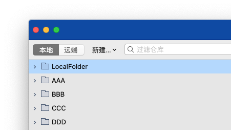

# SourcetreeBrowser
SourcetreeBrowser Editor

### Automatically group according to the url of the git repo, if it is a local repo, group by folder
### Delete duplicate
### Delete the browser label's folder has been deleted

## License

SourcetreeBrowser is released under the MIT license. See [LICENSE](https://github.com/dacaiguoguogmail/SourcetreeBrowser/blob/master/LICENSE) for details.
